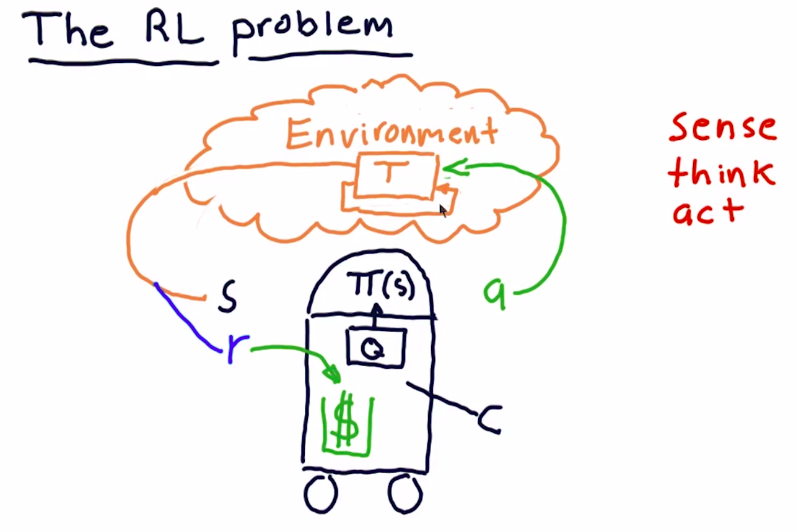

## Definition

A problem:
**The goal** is to choose an action in response to each data point.

Robot: Sense Think Act cycle.

## What's the process?

### Environment

Action -> Transition function -> State of Env

### Agent/Robot

State -> Policy: $\Pi(s)$ -> Collect Rewards, Action

### The goal

How to find $\Pi$ to maximize ?

#### Trading Analog

* Environment = Market
* Action = Buy/Sell
* State = Factors of stocks, e.g. P/E, Rollinger Band Value, etc.
* Rewards = money returns
* Policy: $\Pi$ = Trading strategy
  

## Algorithm type

### Model-Based

Use the transition T or the rewards R in the model.

### Model Free

It does not know or use the models of the transitions T or the rewards R.
