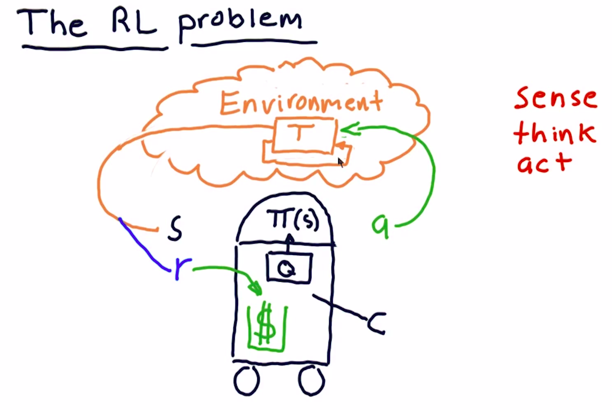

## Definition

A problem:
**The goal** is to choose an action in response to each data point.

Robot: Sense Think Act cycle.

## What's the process?

### Environment

Action -> Transition function -> State of Env

### Agent/Robot

State -> Policy: $\Pi(s)$ -> Collect Rewards, Action

### The goal

How to find $\Pi$ to maximize ?

#### Trading Analog

* Environment = Market
* Action = Buy/Sell
* State = Factors of stocks, e.g. P/E, Rollinger Band Value, etc.
* Rewards = money returns
* Policy: $\Pi$ = Trading strategy
  

## Algorithm type

### Model-Based

Use the transition T or the rewards R in the model.

### Model Free

It does not know or use the models of the transitions T or the rewards R.

## Q-Learning algorithm

It use utility table for Q-Values.

The best part of Q-Learning: it guarantees to provide a optimal policy.

What's Q? 

Q means the function that the algorithm computes

$Q[s,a]=$ immediate rewards + discounted rewards

* Short term rewards: Daily return
* Long term rewards: cumulative return

How to use Q?

$\Pi(s)=argmax_a(Q[s,a])$ 

The optimal:

$\Pi^*(s)=argmax_a(Q^*[s,a])$ 

### Update Rule

$Q'[s,a]$ =$(1-\alpha)Q[s,a]$ + $\alpha$ * improved estimate

where Improved Estimate 

= $r$ + $\gamma$ * later rewards 

= $r$ + $\gamma$ * $Q[S',argmax_a(Q[s',a'])$

$\alpha$ : Learning rate [0, 1.0]

$\gamma$ : discount rate [0, 1.0]

<!-- $Q_i^1 *\gamma$ -->

### State

Can be used as
* Adjusted close/SMA
* Bollinger Band Value
* P/E Ratio
* Holding stock
* Return since entry

Creating the state

* State is an integer
* discretize each factor
* combine all factors

### Discretizing

Convert a real number into integer.

## Summary

### Build a model

* Define states, actions, rewards
* Choose in-sample training period.
* iterate: Q-Table update
* back

### Testing a model

* Backtest on later data.

### Reference

[Reinforcement Q-Learning from Scratch in Python with OpenAI Gym](https://www.learndatasci.com/tutorials/reinforcement-q-learning-scratch-python-openai-gym/)

[Simple Reinforcement Learning: Q-learning](https://towardsdatascience.com/simple-reinforcement-learning-q-learning-fcddc4b6fe56)

[Q-Learning in Python](https://www.geeksforgeeks.org/q-learning-in-python/)