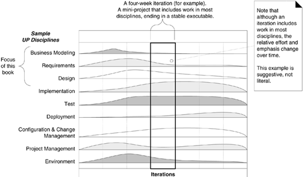

## Ch.1 Object Oriented Analysis and Design(OOA/D)

Objectives:
### What's the book goals and scope?

1. Interactive development process via an agile approach to Unified Process(UP)
   * How to create an excellent OO design? classic OO design metaphor: responsibility-driven design.
    
   * How to use the language for "software blueprints", displaying thought and the form of communication?
2. Introduction to OOA/D and Applying UML.
3. Focus on fundamentals: how to assign responsibilities to objects, UML notation, common design patterns.
   - principles, heuristics or design patterns(problem solution formulas for design principles)
   - **requirements analysis** related to **use cases.**
4. Intermediate level topics: framework design and architectural analysis.

In conclusion:

- Create better object designs by applying principles and patterns
- Iteratively follow common analysis and design activities, an agile approach to UP.
- Create frequently used UML diagrams.
  

### How to define OOA/D?

**Do the right thing**
Analysis is to investigate the problem and requirements rather than a solution.
e.g. Requirements analysis or object oriented analysis.

In OO, analysis is to find and describe the objects/concepts in the problem domain.

**Do the thing right**
Design emphasizes a conceptual solution to fulfil the requirements rather than
its implementation.

In OO, design is to define software objects and how they collaborate to fulfill
the requirements.

### Illustrate a OOA/D example

- Define use cases from requirements (Use case UML)
- Define domain model to show noteworthy domain concepts or objects. Domain model =
  conceptual object model. (Domain Model diagram for real-world classes)
- Assign object responsibilities and collaborations, draw interaction diagrams. (sequence diagram)
- Design class diagram to have a static view of the class. (software classes diagram)

### What's the overview UML and visual agile modeling.

UML is a **visual** language to specify and construct, document the artifacts of systems.

At deeper level in Model Driven Architecture(MDA), UML notation is the UML meta-model.

Three ways to apply UML 
- As Sketch, informal and incomplete hand drawing on whiteboards.
- As Blueprint, reverse engineering to visualize and understand the code or code generation(forward engineering).
- As programming language, to generate the executable code.

#### Three perspectives to apply UML

* Conceptual perspective
* Specification(software) perspective
* Implementation(software) perspective

## Ch.2 Iterative, Evolutionary, and Agile

## How to define an iterative and agile process

Software Development process describes the approach for the software

1. Building
2. Deploying
3. maintaining 

UP includes skill practices

Extreme Programming(XP)

* Test Driven Development(TDD)
* Refactoring
* Continuous integration(CI)

Scrum

* Common Project room(war room)
* daily scrum

Iterative lifecycle

Risk-driven development

### Three reasons to introduce UP

1. UP is an iterative process.
2. UP provides an example structure for how to do OOA/D
3. UP is flexible and a lightweight.

### The central idea of this book

1. How to think and design with objects
2. apply UML
3. use design pattern, agile modeling
4. evolutionary requirements analysis
5. writing use cases.

### Modern iterative, evolutionary and agile methods

1. Scrum
2. Lean Development
3. Dynamic systems development method(DSDM)
4. Feature-Driven Development
5. Adaptive software Development.

## How to define fundamental concepts in the Unified Process(UP)?

Feedback and adaptation evolve the specification and design,
it's known as iterative and evolutionary development.

### 3 Weeks iteration

Monday

1. 1 hour morning clarifying the tasks and goals
2. One person reverse-engineering last iteration code into UML
3. The team use whiteboards for agile modeling, sketching rough UML, write pseudo-code and design notes.

Remaining days:

1. Implementation
1. testing(unit, acceptance, usability)
1. further design
1. integration
1. daily builds.

### How to Handle Change on an Iterative Project?

### Benefits to iterative development

1. Less project failure, better productivity, lower defects rates.
2. Early mitigation of high risks(technical, requirements, objectives, usability, etc)
3. Early visible progress
4. Early feedback, user engagement and adaptation
5. Managed complexity
6. an iteration learning can methodically improve the development process. Iteration by iteration.

### How long should an iteration be? 

Two to six weeks.

Central idea: small steps, rapid feedback, adaptation.

## Waterfall lifecycle

1. High rate of failure
2. Lower productivity
3. higher defect rates.

Waterfall thinking based on speculation and hearsay.

1. Write most requirements before development, 
1. Create thorough and detailed specifications or detailed OO UML models, designs before programming.
1. Write all use cases before starting to program.

### Feedback and Adaptation

1. Early development feedbacks help programmers read specification and client demos to refine requirements.
2. Tests feedbacks help developers refine the design or models.
3. Team progress of early features' feedbacks help refine the schedule and estimates.
4. Client and marketplace feedbacks help re-prioritize the features.

## How to do Iterative and Evolutionary Analysis and Design?

Clarify the requirements in workshops, improve CI/CD must-to-have, design workshops, implement
and testing, elaboration phase, then implement.

### 1. Iteration-1
  Two days for time-boxed requirements workshop, engaged business and development people, chief architect.
   * Day-1 morning, high level requirement analysis, identify use case names, features, and key non-functional requirements.
   * Pick 10% from high level list, which are **architecturally significant, high business value, or high risk** Perhaps 3 use cases.
   * 1.5 days, do intensive detailed analysis for three use cases, UC.
### 2. an iteration planning meeting
Investigate UCs and then design, build, and test within timeboxed iteration. Break them down into a set of more detailed iteration tasks.
### 3. Do iteration-1 over 3 weeks.
   * First 2 days, modeling and design work in pairs, sketching UML diagrams at whiteboards in a common war room, coached and guided by the chief architect.
   * Programming, testing and integrating their work over the remaining weeks, using the modeling UMLs.
   * More testing: unit, acceptance, load, usability, etc.
   * One week before the end, check the goals, de-scope the iteration, put the secondary goals back to TODO list.
   * Tuesday of the last week, code freeze, create iteration baseline.
   * Wednesday morning, demo the partial system to stakeholders, collect feedbacks.

### 4. 2nd requirements workshop near the end of iteration-1. 
Review and refine materials, pick another 10% to 15% use cases with significant and of high business value, analyze them in details.

### 5. Friday morning, hold another iteration planning meeting.
### 6. Do iteration-2 with similar steps.
### 7. Iteration Repeat.
for four iterations and five requirements workshops, 80% to 90% requirements have been written in details, the end of **elaboration phase**.

### 8. Stabilized requirements and then implementation.
Requirements workshops are unlikely. The requirements are stabilized. Keep ask this in each iteration: “Given what we know today, what are the most critical technical and business features we should do in the next three weeks?”

## What is Risk-Driven and Client-Driven Iterative Planning?

1. Risk driven: identify and drive down the highest risks. Including architecture centric iterative development because not having a solid architecture is a common high risk.
2. Client-Driven: build visible features that client cares most about.

## What are Agile Methods and Attitudes?

Basic practice in Agile method:
1. Short timeboxed iterations with evolutionary refinement of plans, 
requirements, and design.
2. promoting practices and principles for simplicity, lightness, communication, self-organizing teams.
3. Four special questions in each stand-up meeting.

### [Agile Manifesto and Principles](https://agilemanifesto.org/)

Agile Alliance ([www.agilealliance.com](http://www.agilealliance.com/)) with a manifesto and statement of principles to capture the spirit of agile methods.

## The Agile Manifesto

| Individuals and interactions | over processes and tools           |
| ---------------------------- | ---------------------------------- |
| *Working software*           | *over comprehensive documentation* |
| *Customer collaboration*     | *over contract negotiation*        |
| *Responding to change*       | *over following a plan*            |

## The Agile Principles

| 1. Our highest priority is to satisfy the customer through early and continuous delivery of valuable software. | 8. Agile processes promote sustainable development.          |
| ------------------------------------------------------------ | ------------------------------------------------------------ |
| 2. Welcome changing requirements, even late in development. Agile processes harness change for the customer's competitive advantage. | 9. The sponsors, developers, and users should be able to maintain a constant pace indefinitely. |
| 3. Deliver working software frequently, from a couple of weeks to a couple of months, with a preference to the shorter time scale. | 10. Continuous attention to technical excellence and good design enhances agility. |
| 4. Business people and developers must work together daily throughout the project. | 11. Simplicity—the art of maximizing the amount of work not done—is essential. |
| 5. Build projects around motivated individuals. Give them the environment and support they need, and trust them to get the job done. | 12. The best architectures, requirements, and designs emerge from self-organizing teams. |
| 6. The most efficient and effective method of conveying information to and within a development team is face-to-face conversation. | 13. At regular intervals, the team reflects on how to become more effective, then tunes and adjusts its behavior accordingly. |
| 7. Working software is the primary measure of progress.      |                                                              |

# What is Agile Modeling?

- The purpose of modeling (sketching UML, ...) is primarily to *understand*, not to document. UML can help quickly explore alternatives and the path to a good OO design.
- Model and apply the UML for the unusual, difficult, tricky parts of the design space.
- Use the simpletest tool possible. Whiteboard or UML CASE tool.
- Model in pairs or triads, discover, understand and share that understanding, rotate pen sketching.
- Create models in parrallel with dynamic-view UML interaction diagram and static-view UML class diagram.
- Treat prior diagrams lightly as throw-away explorations. **Only tested code demonstrates the true design.**
- Developers themselves should do the OO design modeling for themselves.

## Agile Modeling in this Book: Why the Snapshots of UML Sketches?

UML-sketch modeling on whiteboards is a practice I. 

# What is an Agile UP?

1. Prefer a small set of activities and artifacts.
2. Requiremments and designs adaptively emerge through iterations based on feedbacks.
3. Apply UML with agile modeling practices.
4. Phase Plan - High level plan and Detailed Plan - Iteration Plan.

# Critical UP Practices?

1. short timeboxed iterative
2. evolutionary
3. adaptive development
4. tackle high risk and high customer value issues in early iterations.
5. continuously engage users for evaluation, feedbacks, requirements.
6. build a cohesive architecture
7. continously verify quality
8. Apply use cases
9. Visual modeling with UML
10. manage requirements
11. practice change request and configuration management

# What are the UP Phases?

1. ***\*Inception—\**.** approximate vision, business case, scope, vague estimates.
2. ***\*Elaboration—\**.** refined vision, iterative implementation of the **core architecture**, **resolution of high risks**, identification of **most requirements** and scope, more realistic estimates.
3. ***\*Construction—\**.** iterative **implementation** of the remaining lower risk and easier elements, and preparation for deployment.
4. ***\*Transition—\**.** beta **tests, deployment.**

# What are the UP Disciplines?

## What is the Relationship Between the Disciplines and Phases?

**Figure 2.8. Disciplines and phases.**

## How is the Book Structure Influenced by UP Phases and Disciplines?

## Definition: What is the Development Case?

**Table 2.1. Sample Development Case. s - start; r - refine**

| Discipline                  | Practice                                                     |           Artifact | Incep. | Elab.  | Const. | Trans. |
| :-------------------------- | :----------------------------------------------------------- | -----------------: | :----: | :----: | :----: | :----: |
|                             |                                                              |        Iteration → |   I1   | E1..En | C1..Cn | T1..T2 |
| Business Modeling           | agile modeling req. workshop                                 |   **Domain Model** |        |   s    |        |        |
| Requirements                | req. workshop vision box exercise dot voting                 | **Use-Case Model** |   s    |   r    |        |        |
| Vision                      | s                                                            |                  r |        |        |        |        |
| Supplementary Specification | s                                                            |                  r |        |        |        |        |
| Glossary                    | s                                                            |                  r |        |        |        |        |
| Design                      | agile modeling test-driven dev.                              |   **Design Model** |        |   s    |   r    |        |
| SW Architecture Document    |                                                              |                  s |        |        |        |        |
| Data Model                  |                                                              |                  s |   r    |        |        |        |
| Implementation              | test-driven dev. pair programming continuous integration coding standards |                ... |        |        |        |        |
| Project Management          | agile PM daily Scrum meeting                                 |                ... |        |        |        |        |
| ...                         |                                                              |                    |        |        |        |        |

#  Chapter 2. Iterative, Evolutionary, and Agile

|      | *You should use iterative development only on projects that you want to succeed.* |      |
| ---- | ------------------------------------------------------------ | ---- |
|      | --*Martin Fowler*                                            |      |

**OBJECTIVES**

- Provide motivation for the content and order of the book.
- Define an iterative and agile process.
- Define fundamental concepts in the Unified Process.

# Introduction

Iterative development lies at the heart of how OOA/D is best practiced and is presented in this book. Agile practices such as Agile Modeling are key to applying the UML in an effective way. This chapter introduces these subjects, and the Unified Process as a relatively popular *sample* iterative method.

***\*Iterative and evolutionary development—\**.** contrasted with a sequential or “**waterfall**” lifecycle—involves early programming and testing of a partial system, in repeating cycles. It also normally assumes development starts before all the requirements are defined in detail; feedback is used to clarify and improve the evolving specifications.

We rely on short quick development steps, feedback, and adaptation to clarify the requirements and design. To contrast, waterfall values promoted big up-front speculative requirements and design steps before programming. Consistently, success/failure studies show that the waterfall is strongly associated with the highest failure rates for software projects and was historically promoted due to belief or hearsay rather than statistically significant evidence. Research demonstrates that iterative methods are associated with higher success and productivity rates, and lower defect levels.

# What is the UP? Are Other Methods Complementary?

A **software development process** describes an approach to building, deploying, and possibly maintaining software. The **Unified Process** [[JBR99](https://learning.oreilly.com/library/view/applying-uml-and/0131489062/bi01.html#biblio01entry74)] has emerged as a popular *iterative* software development process for building object-oriented systems. In particular, the **Rational Unified Process** or RUP [[Kruchten00](https://learning.oreilly.com/library/view/applying-uml-and/0131489062/bi01.html#biblio01entry81)], a detailed refinement of the Unified Process, has been widely adopted.

Because the Unified Process (UP) is a relatively popular iterative process for projects using OOA/D, and because some process must be used to introduce the subject, the UP shapes the book's structure. Also, since the UP is common and promotes widely recognized best practices, it's useful for industry professionals to know it, and students entering the workforce to be aware of it.

The UP is very flexible and open, and encourages including skillful practices from other iterative methods, such as from **Extreme Programming** (**XP**), **Scrum**, and so forth. For example, XP's **test-driven development, refactoring** and **continuous integration** practices can fit within a UP project. So can Scrum's common project room (“war room”) and daily Scrum meeting practice. Introducing the UP is not meant to downplay the value of these other methods—quite the opposite. In my consulting work, I encourage clients to understand and adopt a blend of useful techniques from several methods, rather than a dogmatic “my method is better than your method” mentality.

## NOTE

*[test-driven development and refactoring](https://learning.oreilly.com/library/view/applying-uml-and/0131489062/ch21.html) p. [385](https://learning.oreilly.com/library/view/applying-uml-and/0131489062/ch21.html)*

The UP combines commonly accepted best practices, such as an iterative lifecycle and risk-driven development, into a cohesive and well-documented process description.

To summarize, this chapter includes an introduction to the UP for three reasons:

1. The UP is an *iterative* process. Iterative development influences how this book introduces OOA/D, and how it is best practiced.
2. UP practices provide an example *structure* for how to do—and thus how to explain—OOA/D. That structure shapes the book structure.
3. The UP is flexible, and can be applied in a lightweight and *agile* approach that includes practices from other agile methods (such as XP or Scrum)—more on this later.

This book presents an introduction to an agile approach to the UP, but not complete coverage. It emphasizes common ideas and artifacts related to an introduction to OOA/D and requirements analysis.

## What If I Don't Care About the UP?

The UP is used as an *example* process within which to explore iterative and evolutionary requirements analysis and OOA/D, since it's necessary to introduce the subject in the context of some process.

But the central ideas of this book—how to think and design with objects, apply UML, use design patterns, agile modeling, evolutionary requirements analysis, writing use cases, and so forth—are independent of any particular process, and apply to many modern iterative, evolutionary, and agile methods, such as Scrum, Lean Development, DSDM, Feature-Driven Development, Adaptive Software Development, and more.

# What is Iterative and Evolutionary Development?

A key practice in both the UP and most other modern methods is **iterative development**. In this lifecycle approach, development is organized into a series of short, fixed-length (for example, three-week) mini-projects called **iterations**; the outcome of each is a tested, integrated, and executable *partial* system. Each iteration includes its own requirements analysis, design, implementation, and testing activities.

The iterative lifecycle is based on the successive enlargement and refinement of a system through multiple iterations, with cyclic feedback and adaptation as core drivers to converge upon a suitable system. The system grows incrementally over time, iteration by iteration, and thus this approach is also known as **iterative and incremental development** (see [Figure 2.1](https://learning.oreilly.com/library/view/applying-uml-and/0131489062/ch02.html#ch02fig01)). Because feedback and adaptation evolve the specifications and design, it is also known as **iterative and evolutionary development**.

**Figure 2.1. Iterative and evolutionary development.**

Early iterative process ideas were known as spiral development and evolutionary development [[Boehm88](https://learning.oreilly.com/library/view/applying-uml-and/0131489062/bi01.html#biblio01entry18), [Gilb88](https://learning.oreilly.com/library/view/applying-uml-and/0131489062/bi01.html#biblio01entry59)].

**EXAMPLE**

As an example (not a recipe), in a three-week iteration early in the project, perhaps one hour Monday morning is spent in a kickoff meeting with the team clarifying the tasks and goals of the iteration. Meanwhile, one person reverse-engineers the last iteration's code into UML diagrams (via a CASE tool), and prints and displays noteworthy diagrams. The team spends the remainder of Monday at whiteboards, working in pairs while agile modeling, sketching rough UML diagrams captured on digital cameras, and writing some pseudocode and design notes. The remaining days are spent on implementation, testing (unit, acceptance, usability, ...), further design, integration, and daily builds of the partial system. Other activities include demonstrations and evaluations with stakeholders, and planning for the next iteration.

Notice in this example that there is neither a rush to code, nor a long drawn-out design step that attempts to perfect all details of the design before programming. A “little” forethought regarding the design with visual modeling using rough and fast UML drawings is done; perhaps a half or full day by developers doing design work UML sketching in pairs at whiteboards.

The result of each iteration is an executable but incomplete system; it is not ready to deliver into production. The system may not be eligible for production deployment until after many iterations; for example, 10 or 15 iterations.

The output of an iteration is *not* an experimental or throw-away prototype, and iterative development is not prototyping. Rather, the output is a production-grade subset of the final system.

## How to Handle Change on an Iterative Project?

The subtitle of one book that discusses iterative development is *Embrace Change* [[Beck00](https://learning.oreilly.com/library/view/applying-uml-and/0131489062/bi01.html#biblio01entry12)]. This phrase is evocative of a key attitude of iterative development: Rather than fighting the inevitable change that occurs in software development by trying (unsuccessfully) to fully and correctly specify, freeze, and “sign off” on a frozen requirement set and design before implementation (in a “waterfall” process), iterative and evolutionary development is based on an attitude of embracing change and adaptation as unavoidable and indeed essential drivers.

This is not to say that iterative development and the UP encourage an uncontrolled and reactive “feature creep”-driven process. Subsequent chapters explore how the UP balances the need—on the one hand—to agree upon and stabilize a set of requirements, with—on the other hand—the reality of changing requirements, as stakeholders clarify their vision or the marketplace changes.

Each iteration involves choosing a small subset of the requirements, and quickly designing, implementing, and testing. In early iterations the choice of requirements and design may not be exactly what is ultimately desired. But the act of swiftly taking a small step, before all requirements are finalized, or the entire design is speculatively defined, leads to rapid feedback—feedback from the users, developers, and tests (such as load and usability tests).

And this early feedback is worth its weight in gold; rather than *speculating* on the complete, correct requirements or design, the team mines the feedback from realistic building and testing something for crucial practical insight and an opportunity to modify or adapt understanding of the requirements or design. End-users have a chance to quickly see a partial system and say, “Yes, that's what I asked for, but now that I try it, what I really want is something slightly different.”[[1\]](https://learning.oreilly.com/library/view/applying-uml-and/0131489062/ch02.html#ftn.ch02fn01) This “yes...but” process is not a sign of failure; rather, early and frequent structured cycles of “yes...buts” are a skillful way to make progress and discover what is of real value to the stakeholders. Yet this is not an endorsement of chaotic and reactive development in which developers continually change direction—a middle way is possible.

In addition to requirements clarification, activities such as load testing will prove if the partial design and implementation are on the right path, or if in the next iteration, a change in the core architecture is required. Better to resolve and *prove* the risky and critical design decisions early rather than late—and iterative development provides the mechanism for this.

Consequently, work proceeds through a series of structured build-feedback-adapt cycles. Not surprisingly, in early iterations the deviation from the “true path” of the system (in terms of its final requirements and design) will be larger than in later iterations. Over time, the system converges towards this path, as illustrated in [Figure 2.2](https://learning.oreilly.com/library/view/applying-uml-and/0131489062/ch02.html#ch02fig02).

**Figure 2.2. Iterative feedback and evolution leads towards the desired system. The requirements and design instability lowers over time.**

## Are There Benefits to Iterative Development?

Yes. Benefits include:

- less project failure, better productivity, and lower defect rates; shown by research into iterative and evolutionary methods
- early rather than late mitigation of high risks (technical, requirements, objectives, usability, and so forth)
- early visible progress
- early feedback, user engagement, and adaptation, leading to a refined system that more closely meets the real needs of the stakeholders
- managed complexity; the team is not overwhelmed by “analysis paralysis” or very long and complex steps
- the learning within an iteration can be methodically used to improve the development process itself, iteration by iteration

## How Long Should an Iteration Be? What is Iteration Timeboxing?

Most iterative methods recommend an iteration length between two and six weeks. Small steps, rapid feedback, and adaptation are central ideas in iterative development; long iterations subvert the core motivation for iterative development and increase project risk. In only one week it is often difficult to complete sufficient work to get meaningful throughput and feedback; more than six weeks, and the complexity becomes rather overwhelming, and feedback is delayed. A very long timeboxed iteration misses the point of iterative development. Short is good.

A key idea is that iterations are **timeboxed**, or fixed in length. For example, if the next iteration is chosen to be three weeks long, then the partial system *must* be integrated, tested, and stabilized by the scheduled date—date slippage is illegal. If it seems that it will be difficult to meet the deadline, the recommended response is to de-scope—remove tasks or requirements from the iteration, and include them in a future iteration, rather than slip the completion date.

# What About the Waterfall Lifecycle?

In a **waterfall** (or sequential) lifecycle process there is an attempt to define (in detail) all or most of the requirements before programming. And often, to create a thorough design (or set of models) before programming. Likewise, an attempt to define a “reliable” plan or schedule near the start—not that it will be.

**WARNING: SUPERIMPOSING WATERFALL ON ITERATIVE**

If you find yourself on an “iterative” project where most of the requirements are written before development begins, or there is an attempt to create many thorough and detailed specifications or UML models and designs before programming, know that waterfall thinking has unfortunately afflicted the project. It is not a healthy iterative or UP project, regardless of claims.

Research (collected from many sources and summarized in [[Larman03](https://learning.oreilly.com/library/view/applying-uml-and/0131489062/bi01.html#biblio01entry84)] and [[LB03](https://learning.oreilly.com/library/view/applying-uml-and/0131489062/bi01.html#biblio01entry86)]) now shows conclusively that the 1960s and 1970s-era advice to apply the waterfall was—ironically—a poor practice for most software projects, rather than a skillful approach. It is strongly associated with high rates of failure, lower productivity, and higher defect rates (than iterative projects). On average, 45% of the features in waterfall requirements are never used, and early waterfall schedules and estimates vary up to 400% from the final actuals.

## NOTE

*feature use research p. [56](https://learning.oreilly.com/library/view/applying-uml-and/0131489062/ch05.html#ch05lev1sec4)*

In hindsight, we now know that waterfall advice was based on *speculation* and *hearsay*, rather than evidence-based practices. In contrast, iterative and evolutionary practices are backed by evidence—studies show they are less failure prone, and associated with better productivity and defect rates.

## Guideline: Don't Let Waterfall Thinking Invade an Iterative or UP Project

I need to emphasize that “waterfall thinking” often incorrectly still invades a so-called iterative or UP project. Ideas such as “let's write all the use cases before starting to program” or “let's do many detailed OO models in UML before starting to program” are examples of unhealthy waterfall thinking incorrectly superimposed on the UP. The creators of the UP cite this misunderstanding—big up-front analysis and modeling—as a key reason for its failed adoption [[KL01](https://learning.oreilly.com/library/view/applying-uml-and/0131489062/bi01.html#biblio01entry79)].

## Why is the Waterfall so Failure-Prone?

There isn't one simple answer to why the waterfall is so failure-prone, but it is strongly related to a key false assumption underlying many failed software projects—that the specifications are predictable and stable and can be correctly defined at the start, with low change rates. This turns out to be far from accurate—and a costly misunderstanding. A study by Boehm and Papaccio showed that a typical software project experienced a 25% change in requirements [[BP88](https://learning.oreilly.com/library/view/applying-uml-and/0131489062/bi01.html#biblio01entry23)]. And this trend was corroborated in another major study of thousands of software projects, with change rates that go even higher—35% to 50% for large projects—as illustrated in [Figure 2.3](https://learning.oreilly.com/library/view/applying-uml-and/0131489062/ch02.html#ch02fig03) [[Jones97](https://learning.oreilly.com/library/view/applying-uml-and/0131489062/bi01.html#biblio01entry76)].

**Figure 2.3. Percentage of change on software projects of varying sizes.**

These are *extremely* high change rates. What this data shows—as any experienced developer or manager is painfully aware—is that software development is (on average) a domain of high change and instability—also known as the domain of **new product development**. Software is not usually a domain of predictable or mass manufacturing—low-change areas where it is possible and efficient to define all the stable specifications and reliable plans near the start.

Thus, any analysis, modeling, development, or management practice based on the assumption that things are long-term stable (i.e., the waterfall) is fundamentally flawed. *Change* is the constant on software projects. Iterative and evolutionary methods assume and embrace change and adaptation of *partial and evolving* specifications, models, and plans based on feedback.

## The Need for Feedback and Adaptation

In complex, changing systems (such as most software projects) feedback and adaptation are key ingredients for success.

- Feedback from early development, programmers trying to read specifications, and client demos to refine the requirements.
- Feedback from tests and developers to refine the design or models.
- Feedback from the progress of the team tackling early features to refine the schedule and estimates.
- Feedback from the client and marketplace to re-prioritize the features to tackle in the next iteration.

# How to do Iterative and Evolutionary Analysis and Design?

This introduction may have given the impression that there is no value in analysis and design before programming, but that is a misunderstanding as extreme as thinking that “complete” up-front analysis is skillful. There is a middle way. Here's a short *example* (not a recipe) of how it can work on a well-run UP project. This assumes there will ultimately be 20 iterations on the project before delivery:

1. Before iteration-1, hold the first timeboxed requirements workshop, such as exactly two days. Business and development people (including the chief architect) are present.
   - On the morning of day one, do high-level requirements analysis, such as identifying just the names of the use cases and features, and key non-functional requirements. The analysis will not be perfect.
   - Ask the chief architect and business people to pick 10% from this high-level list (such as 10% of the 30 use case names) that have a blending of these three qualities: 1) architecturally significant (if implemented, we are forced to design, build, and test the core architecture), 2) high business value (features business really cares about), and 3) high risk (such as “be able to handle 500 concurrent transactions”). Perhaps three use cases are thus identified: UC2, UC11, UC14.
   - For the remaining 1.5 days, do intensive detailed analysis of the functional and non-functional requirements for these three use cases. When finished, 10% are deeply analyzed, and 90% are only high-level.
2. Before iteration-1, hold an iteration planning meeting in which a subset from UC2, UC11, and UC14 are chosen to design, build, and test within a specified time (for example, four-week timeboxed iteration). Note that not all of these three use cases can be built in iteration-1, as they will contain too much work. After choosing the specific subset goals, break them down into a set of more detailed iteration tasks, with help from the development team.
3. Do iteration-1 over three or four weeks (pick the timebox, and stick to it).
   - On the first two days, developers and others do modeling and design work in pairs, sketching UML-ish diagrams at many whiteboards (along with sketching other kinds of models) in a common war room, coached and guided by the chief architect.
   - Then the developers take off their “modeling hats” and put on their “programming hats.” They start programming, testing, and integrating their work continuously over the remaining weeks, using the modeling sketches as a starting point of inspiration, knowing that the models are partial and often vague.
   - Much testing occurs: unit, acceptance, load, usability, and so forth.
   - One week before the end, ask the team if the original iteration goals can be met; if not, de-scope the iteration, putting secondary goals back on the “to do” list.
   - On Tuesday of the last week there's a code freeze; all code must be checked in, integrated, and tested to create the iteration baseline.
   - On Wednesday morning, demo the partial system to external stakeholders, to show early visible progress. Feedback is requested.
4. Do the second requirements workshop near the end of iteration-1, such as on the last Wednesday and Thursday. Review and refine all the material from the last workshop. Then pick another 10% or 15% of the use cases that are architecturally significant and of high business value, and analyze them in detail for one or two days. When finished, perhaps 25% of the use cases and non-functional requirements will be written in detail. They won't be perfect.
5. On Friday morning, hold another iteration planning meeting for the next iteration.
6. Do iteration-2; similar steps.
7. Repeat, for four iterations and five requirements workshops, so that at the end of iteration-4, perhaps 80% or 90% of the requirements have been written in detail, but only 10% of the system has been implemented.
   - Note that this large, detailed set of requirements is based on feedback and evolution, and is thus of much higher quality than purely speculative waterfall specifications.
8. We are perhaps only 20% into the duration of the overall project. In UP terms, this is the end of the **elaboration phase**. At this point, estimate in detail the effort and time for the refined, high-quality requirements. Because of the significant realistic investigation, feedback, and early programming and testing, the estimates of what can be done and how long it will take are much more reliable.
9. After this point, requirements workshops are unlikely; the requirements are stabilized—though never completely frozen. Continue in a series of three-week iterations, choosing the next step of work adaptively in each iteration planning meeting on the final Friday, re-asking the question each iteration, “Given what we know today, what are the most critical technical and business features we should do in the next three weeks?”

[Figure 2.5](https://learning.oreilly.com/library/view/applying-uml-and/0131489062/ch02.html#ch02fig04) illustrates the approach for a 20-iteration project.

**Figure 2.5. A UML sketch of a sequence diagram from a project.**

In this way, after a few iterations of early exploratory development, there comes a point when the team can more reliably answer “what, how much, when.”

# What is Risk-Driven and Client-Driven Iterative Planning?

The UP (and most new methods) encourage a combination of **risk-driven** and **client-driven** iterative planning. This means that the goals of the early iterations are chosen to 1) identify and drive down the highest risks, and 2) build visible features that the client cares most about.

Risk-driven iterative development includes more specifically the practice of **architecture-centric** iterative development, meaning that early iterations focus on building, testing, and stabilizing the core architecture. Why? Because not having a solid architecture is a common high risk.

**BOOK ITERATIONS VS. REAL PROJECT ITERATIONS**

Iteration-1 of the case studies in this book is driven by learning goals rather than true project goals. Therefore, iteration-1 is not architecture-centric or risk-driven. On a real project, we would tackle difficult and risky things first. But in the context of a book helping people learn fundamental OOA/D and UML, that's impractical—we need to start with problems illustrating basic principles, not the most difficult topics and problems.

# What are Agile Methods and Attitudes?

**Agile development** methods usually apply timeboxed iterative and evolutionary development, employ adaptive planning, promote incremental delivery, and include other values and practices that encourage *agility*—rapid and flexible response to change.

**Figure 2.4. Evolutionary analysis and design—the majority in early iterations.**

It is not possible to exactly define **agile methods**, as specific practices vary widely. However, short timeboxed iterations with evolutionary refinement of plans, requirements, and design is a basic practice the methods share. In addition, they promote practices and principles that reflect an agile sensibility of simplicity, lightness, communication, self-organizing teams, and more.

Example practices from the Scrum agile method include a *common project workroom* and *self-organizing teams* that coordinate through a daily stand-up meeting with four special questions each member answers. Example practices from the Extreme Programming (XP) method include *programming in pairs* and **test-driven development**.

## NOTE

*[TDD](https://learning.oreilly.com/library/view/applying-uml-and/0131489062/ch21.html) p. [385](https://learning.oreilly.com/library/view/applying-uml-and/0131489062/ch21.html)*

Any iterative method, including the UP, can be applied in an agile spirit. And the UP itself is flexible, encouraging a “whatever works” attitude to include practices from Scrum, XP, and other methods.

## The Agile Manifesto and Principles

## The Agile Manifesto

| *Individuals and interactions* | *over processes and tools*         |
| ------------------------------ | ---------------------------------- |
| *Working software*             | *over comprehensive documentation* |
| *Customer collaboration*       | *over contract negotiation*        |
| *Responding to change*         | *over following a plan*            |

## The Agile Principles

| 1. Our highest priority is to satisfy the customer through early and continuous delivery of valuable software. | 8. Agile processes promote sustainable development.          |
| ------------------------------------------------------------ | ------------------------------------------------------------ |
| 2. Welcome changing requirements, even late in development. Agile processes harness change for the customer's competitive advantage. | 9. The sponsors, developers, and users should be able to maintain a constant pace indefinitely. |
| 3. Deliver working software frequently, from a couple of weeks to a couple of months, with a preference to the shorter time scale. | 10. Continuous attention to technical excellence and good design enhances agility. |
| 4. Business people and developers must work together daily throughout the project. | 11. Simplicity—the art of maximizing the amount of work not done—is essential. |
| 5. Build projects around motivated individuals. Give them the environment and support they need, and trust them to get the job done. | 12. The best architectures, requirements, and designs emerge from self-organizing teams. |
| 6. The most efficient and effective method of conveying information to and within a development team is face-to-face conversation. | 13. At regular intervals, the team reflects on how to become more effective, then tunes and adjusts its behavior accordingly. |
| 7. Working software is the primary measure of progress.      |                                                              |

In 2001 a group interested in iterative and agile methods (coining the term) met to find common ground. Out of this came the Agile Alliance ([www.agilealliance.com](http://www.agilealliance.com/)) with a manifesto and statement of principles to capture the spirit of agile methods.

# What is Agile Modeling?

Experienced analysts and modelers know the *secret of modeling*:

- The purpose of modeling (sketching UML, ...) is primarily to *understand*, not to document.

## NOTE

*[more on agile modeling](https://learning.oreilly.com/library/view/applying-uml-and/0131489062/ch14.html#ch14lev1sec2) p. [214](https://learning.oreilly.com/library/view/applying-uml-and/0131489062/ch14.html#ch14lev1sec2)*

That is, the very act of modeling can and should provide a way to better understand the problem or solution space. From this viewpoint, the purpose of “doing UML” (which should really mean “doing OOA/D”) is *not* for a designer to create many detailed UML diagrams that are handed off to a programmer (which is a very un-agile and waterfall-oriented mindset), but rather to quickly explore (more quickly than with code) alternatives and the path to a good OO design.

This view, consistent with agile methods, has been called **agile modeling** in the book (amazingly called) *Agile Modeling* [[Ambler02](https://learning.oreilly.com/library/view/applying-uml-and/0131489062/bi01.html#biblio01entry06)]. It implies a number of practices and values, including:

- Adopting an agile method does not mean avoiding any modeling; that's a misunderstanding. Many agile methods, such as Feature-Driven Development, DSDM, and Scrum, normally include significant modeling sessions. Even the XP founders, from perhaps the most well-known agile method with the least emphasis on modeling, endorsed agile modeling as described by Ambler—and practiced by many modelers over the years.
- The purpose of modeling and models is primarily to support understanding and communication, not documentation.
- Don't model or apply the UML to all or most of the software design. Defer simple or straightforward design problems until programming—solve them while programming and testing. Model and apply the UML for the smaller percentage of unusual, difficult, tricky parts of the design space.
- Use the simplest tool possible. Prefer “low energy” creativity-enhancing simple tools that support rapid input and change. Also, choose tools that support large visual spaces. For example, prefer sketching UML on whiteboards, and capturing the diagrams with a digital camera.[[2\]](https://learning.oreilly.com/library/view/applying-uml-and/0131489062/ch02.html#ftn.ch02fn02)
  - This doesn't mean UML CASE tools or word processors can't be used or have no value, but especially for the creative work of discovery, sketching on whiteboards supports quick creative flow and change. The key rule is ease and agility, whatever the technology.
- Don't model alone, model in pairs (or triads) at the whiteboard, in the awareness that the purpose of modeling is to discover, understand, and share that understanding. Rotate the pen sketching across the members so that all participate.
- Create models in parallel. For example, on one whiteboard start sketching a dynamic-view UML interaction diagram, and on another whiteboard, start sketching the complementary static-view UML class diagram. Develop the two models (two views) together, switching back and forth.
- Use “good enough” simple notation while sketching with a pen on whiteboards. Exact UML details aren't important, as long as the modelers understand each other. Stick to simple, frequently used UML elements.
- Know that all models will be inaccurate, and the final code or design different—sometimes dramatically different—than the model. Only tested code demonstrates the true design; all prior diagrams are incomplete hints, best treated lightly as throw-away explorations.
- Developers themselves should do the OO design modeling, for themselves, not to create diagrams that are given to other programmers to implement—an example of un-agile waterfall-oriented practices.

## Agile Modeling in this Book: Why the Snapshots of UML Sketches?

UML-sketch modeling on whiteboards is a practice I—and many developers—have enthusiastically coached and practiced for years. Yet most of the UML diagrams in this book give the impression I don't work that way, because they've been drawn neatly with a tool, for readability. To balance that impression the book occasionally includes digital snapshot pictures of whiteboard UML sketches. It sacrifices legibility but reminds that agile modeling is useful and is the actual practice behind the case studies.

For example, [Figure 2.5](https://learning.oreilly.com/library/view/applying-uml-and/0131489062/ch02.html#ch02fig04) is an unedited UML sketch created on a project I was coaching. It took about 20 minutes to draw, with four developers standing around. We needed to understand the inter-system collaboration. The act of drawing it together provided a context to contribute unique insights and reach shared understanding. This captures the feel of how agile modelers apply the UML.

# What is an Agile UP?

The UP was not meant by its creators to be heavy or un-agile, although its large *optional* set of activities and artifacts have understandably led some to that impression. Rather, it was meant to be adopted and applied in the spirit of adaptability and lightness—an **agile** UP. Some examples of how this applies:

- Prefer a *small* set of UP activities and artifacts. Some projects will benefit more than others, but, in general, keep it simple. Remember that all UP artifacts are optional, and avoid creating them unless they add value. Focus on early programming, not early documenting.

  ## NOTE

  *[customizing UP](https://learning.oreilly.com/library/view/applying-uml-and/0131489062/ch02.html#ch02lev1sec13) p. [37](https://learning.oreilly.com/library/view/applying-uml-and/0131489062/ch02.html#ch02lev1sec13)*

- Since the UP is iterative and evolutionary, requirements and designs are not completed before implementation. They adaptively emerge through a series of iterations, based on feedback.

  ## NOTE

  *[evolutionary A&D](https://learning.oreilly.com/library/view/applying-uml-and/0131489062/ch02.html#ch02lev1sec5) p. [25](https://learning.oreilly.com/library/view/applying-uml-and/0131489062/ch02.html#ch02lev1sec5)*

- Apply the UML with agile modeling practices.

  ## NOTE

  *[agile models](https://learning.oreilly.com/library/view/applying-uml-and/0131489062/ch02.html#ch02lev1sec8) p. [30](https://learning.oreilly.com/library/view/applying-uml-and/0131489062/ch02.html#ch02lev1sec8)*

- There isn't a *detailed* plan for the entire project. There is a high-level plan (called the **Phase Plan**) that estimates the project end date and other major milestones, but it does not detail the fine-grained steps to those milestones. A detailed plan (called the **Iteration Plan**) only plans with greater detail one iteration in advance. Detailed planning is done adaptively from iteration to iteration.

## NOTE

*[agile PM](https://learning.oreilly.com/library/view/applying-uml-and/0131489062/ch40.html) p. [673](https://learning.oreilly.com/library/view/applying-uml-and/0131489062/ch40.html)*

The case studies emphasize a relatively small number of artifacts, and iterative development, in the spirit of an agile UP.

# Are There Other Critical UP Practices?

The central idea to appreciate and practice in the UP is short timeboxed iterative, evolutionary, and adaptive development. Some additional best practices and key concepts in the UP:

- tackle high-risk and high-value issues in early iterations
- continuously engage users for evaluation, feedback, and requirements
- build a cohesive, core architecture in early iterations
- continuously verify quality; test early, often, and realistically
- apply use cases where appropriate
- do some visual modeling (with the UML)
- carefully manage requirements
- practice change request and configuration management

# What are the UP Phases?

A UP project organizes the work and iterations across four major phases:

1. ***\*Inception—\**.** approximate vision, business case, scope, vague estimates.
2. ***\*Elaboration—\**.** refined vision, iterative implementation of the core architecture, resolution of high risks, identification of most requirements and scope, more realistic estimates.
3. ***\*Construction—\**.** iterative implementation of the remaining lower risk and easier elements, and preparation for deployment.
4. ***\*Transition—\**.** beta tests, deployment.

These phases are more fully defined in subsequent chapters.

This is *not* the old “waterfall” or sequential lifecycle of first defining all the requirements, and then doing all or most of the design.

Inception is not a requirements phase; rather, it is a feasibility phase, where just enough investigation is done to support a decision to continue or stop.

Similarly, elaboration is not the requirements or design phase; rather, it is a phase where the core architecture is iteratively implemented, and high-risk issues are mitigated.

[Figure 2.6](https://learning.oreilly.com/library/view/applying-uml-and/0131489062/ch02.html#ch02fig06) illustrates common schedule-oriented terms in the UP. Notice that one development cycle (which ends in the release of a system into production) is composed of many iterations.

**Figure 2.6. Schedule-oriented terms in the UP.**

# What are the UP Disciplines?

The UP describes work activities, such as writing a use case, within **disciplines**—a set of activities (and related artifacts) in one subject area, such as the activities within requirements analysis. In the UP, an **artifact** is the general term for any work product: code, Web graphics, database schema, text documents, diagrams, models, and so on.

There are several disciplines in the UP; this book focuses on some artifacts in the following three:

- ***\*Business Modeling—\**.** The Domain Model artifact, to visualize noteworthy concepts in the application domain.
- ***\*Requirements—\**.** The Use-Case Model and Supplementary Specification artifacts to capture functional and non-functional requirements.
- ***\*Design—\**.** The Design Model artifact, to design the software objects.

A longer list of UP disciplines is shown in [Figure 2.7](https://learning.oreilly.com/library/view/applying-uml-and/0131489062/ch02.html#ch02fig07).

**Figure 2.7. UP disciplines.**

In the UP, **Implementation** means programming and building the system, not deploying it. The **Environment** discipline refers to establishing the tools and customizing the process for the project—that is, setting up the tool and process environment.

## What is the Relationship Between the Disciplines and Phases?

As illustrated in [Figure 2.7](https://learning.oreilly.com/library/view/applying-uml-and/0131489062/ch02.html#ch02fig07), during one iteration work goes on in most or all disciplines. However, the relative effort across these disciplines changes over time. Early iterations naturally tend to apply greater relative emphasis to requirements and design, and later ones less so, as the requirements and core design stabilize through a process of feedback and adaptation.

Relating this to the UP phases (inception, elaboration, ...), [Figure 2.8](https://learning.oreilly.com/library/view/applying-uml-and/0131489062/ch02.html#ch02fig08) illustrates the changing relative effort with respect to the phases; please note these are suggestive, not literal. In elaboration, for example, the iterations tend to have a relatively high level of requirements and design work, although definitely some implementation as well. During construction, the emphasis is heavier on implementation and lighter on requirements analysis.

**Figure 2.8. Disciplines and phases.**

## How is the Book Structure Influenced by UP Phases and Disciplines?

With respect to the phases and disciplines, what is the focus of the case studies?

The case studies emphasize the inception and elaboration phase. They focus on some artifacts in the Business Modeling, Requirements, and Design disciplines, as this is where requirements analysis, OOA/D, patterns, and the UML are primarily applied.

The earlier chapters introduce activities in inception; later chapters explore several iterations in elaboration. The following list and [Figure 2.9](https://learning.oreilly.com/library/view/applying-uml-and/0131489062/ch02.html#ch02fig09) describe the organization with respect to the UP phases.

1. The inception phase chapters introduce the basics of requirements analysis.
2. Iteration 1 introduces fundamental OOA/D and assignment of responsibilities to objects.
3. Iteration 2 focuses on object design, especially on introducing some high-use “design patterns.”
4. Iteration 3 introduces a variety of subjects, such as architectural analysis and framework design.

**Figure 2.9. Book organization is related to the UP phases and iterations.**

# How to Customize the Process? The UP Development Case

## Are There Optional Artifacts or Practices in the UP?

Yes! Almost everything is optional. That said, some UP practices and principles are invariant, such as iterative and risk-driven development, and continuous verification of quality.

However, a key insight into the UP is that all activities and artifacts (models, diagrams, documents, ...) are *optional*—well, maybe not the code!

**ANALOGY**

The set of possible artifacts described in the UP should be viewed like a set of medicines in a pharmacy. Just as one does not indiscriminately take many medicines, but matches the choice to the ailment, likewise on a UP project, a team should select a small subset of artifacts that address its particular problems and needs. In general, focus on a *small* set of artifacts that demonstrate high practical value.

## Definition: What is the Development Case?

The choice of practices and UP artifacts for a project may be written up in a short document called the **Development Case** (an artifact in the Environment discipline). For example, [Table 2.1](https://learning.oreilly.com/library/view/applying-uml-and/0131489062/ch02.html#ch02table03) could be the Development Case for the “NextGen Project” case study explored in this book.

**Table 2.1. Sample Development Case. s - start; r - refine**

| Discipline                  | Practice                                                     |       Artifact | Incep. | Elab.  | Const. | Trans. |
| :-------------------------- | :----------------------------------------------------------- | -------------: | :----: | :----: | :----: | :----: |
|                             |                                                              |    Iteration → |   I1   | E1..En | C1..Cn | T1..T2 |
| Business Modeling           | agile modeling req. workshop                                 |   Domain Model |        |   s    |        |        |
| Requirements                | req. workshop vision box exercise dot voting                 | Use-Case Model |   s    |   r    |        |        |
| Vision                      | s                                                            |              r |        |        |        |        |
| Supplementary Specification | s                                                            |              r |        |        |        |        |
| Glossary                    | s                                                            |              r |        |        |        |        |
| Design                      | agile modeling test-driven dev.                              |   Design Model |        |   s    |   r    |        |
| SW Architecture Document    |                                                              |              s |        |        |        |        |
| Data Model                  |                                                              |              s |   r    |        |        |        |
| Implementation              | test-driven dev. pair programming continuous integration coding standards |            ... |        |        |        |        |
| Project Management          | agile PM daily Scrum meeting                                 |            ... |        |        |        |        |
| ...                         |                                                              |                |        |        |        |        |

Subsequent chapters describe the creation of some of these artifacts, including the Domain Model, Use-Case Model, and Design Model.

The example practices and artifacts presented in this case study are by no means sufficient for, or suitable for, all projects. For example, a machine control system may benefit from many state diagrams. A Web-based e-commerce system may require a focus on user interface prototypes. A “green-field” new development project has very different design artifact needs than a systems integration project.

# You Know You Didn't Understand Iterative Development or the UP When...

- You try to define requirements before design or implementation, define design before implementation, or define an architecture before iterative programming and testing.
- Doing UML modeling before programming, regarding programming as a simple mechanical translation of UML into code.
- Believing inception = requirements, elaboration = design, and construction = implementation (that is, superimposing the waterfall on the UP).
- Regarding elaboration purpose is to define models and construct code.
- Iteration length is three months long instead of **three weeks.**
- Adpoting the UP means many activities and create many documents.
- Plan a project in details, speculatively predict activities.

# History

In the late **1950s**, evolutionary, iterative, and incremental development (IID), rather than the waterfall. 

 The first published paper promoting iterative rather than waterfall development was published in **1968** at the IBM T.J. Watson Research Center.

IID was used on many large defense and aerospace projects in the **1970s**. 

Also in the **1980s**, Dr. Frederick Brooks (of *Mythical Man-Month* fame), wrote and spoke about the shortcomings of the waterfall and the need to instead use IID methods. 

By the early **1990s**, IID was widely recognized as the successor to the waterfall, and there was a flowering of iterative and evolutionary methods: UP, DSDM, Scrum, XP, and many more.

