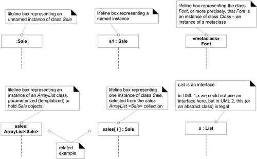

## Chapter 8

## Chapter 13 Logical Architecture and UML Package Diagrams

### Layer design
- UI layer
- application logic(domain) layer

### What is the Logical Architecture? And Layers?
The logical architecture is the large-scale organization of the software classes into 
packages (or namespaces), subsystems, and layers. 

## Chapter 15 UML Interaction Diagrams

## What's the purpose?

Illustrate how objects interact via messages, used for dynamic object modeling.

### Sequence and Communication Diagrams

**Sequence diagrams** illustrate interactions in a kind of **fence** format.

* It's closer to UML specification
* Mapping to call-flow sequence from reading top to bottom
* reverse-engineered call-flow sequence from source code.

**Communication diagrams** illustrate object interactions in a **graph** or **network** format, in which objects can be placed anywhere on the diagram.

* "UML as sketch" for agile modeling.
* Simpler
* Easier to add new objects.

|     Type      |                          Strengths                           |                          Weaknesses                          |
| :-----------: | :----------------------------------------------------------: | :----------------------------------------------------------: |
|   sequence    | clearly shows sequence or time ordering of messageslarge set of detailed notation options | forced to extend to the right when adding new objects; consumes horizontal space |
| communication | space economical—flexibility to add new objects in two dimensions | more difficult to see sequence of messagesfewer notation options |

