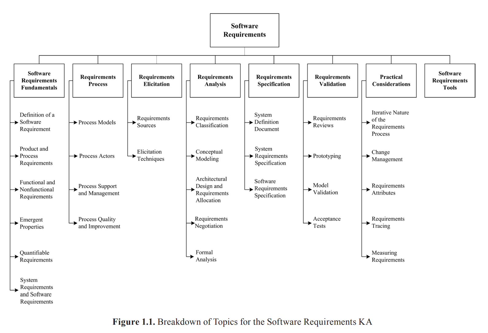
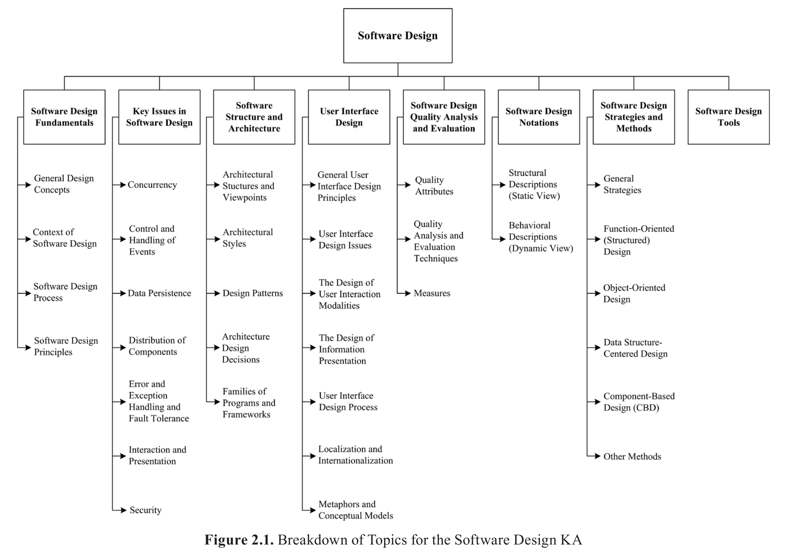
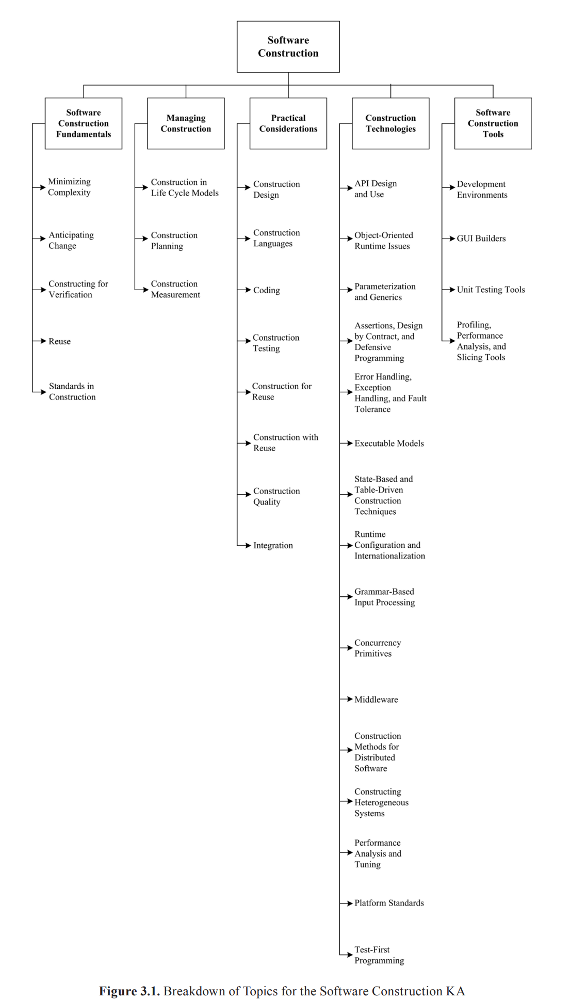
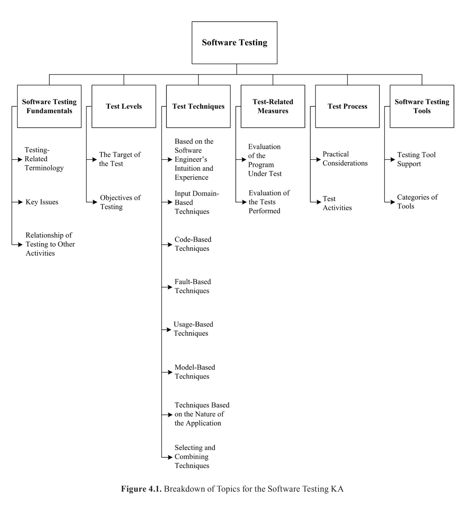
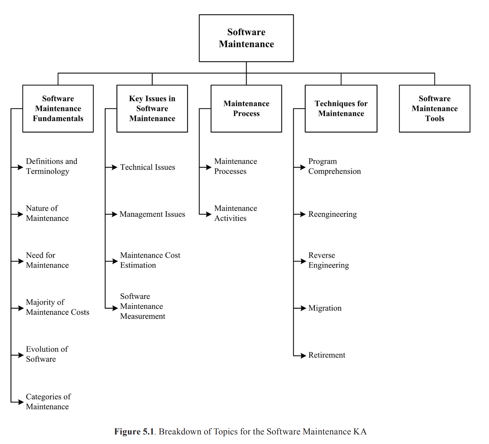
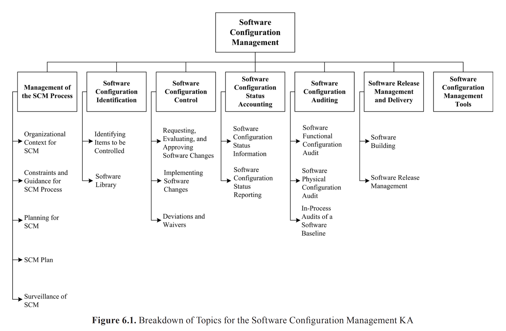

## Chapter 2
## What's Design?
Design is both

- "the process of defining the architecture, components, interfaces and
other characteristics of a system or component"
- the result of the above process.

## Design steps

- Generate various models
- Analyze and evaluate their solutions and tradeoffs according to requirements.
- Use resulting model to plan system verification, validation, construction and testing.

[The difference between Verification and Validation](https://www.easterbrook.ca/steve/2010/11/the-difference-between-verification-and-validation/)

A wicked problem is a problem with no definitive solution.

## Breakdowns

## Reference

[Software Engineering Body of Knowledge V3.0 - SWEBOK V3.0, 2014](https://cs.fit.edu/~kgallagher/Schtick/Serious/SWEBOKv3.pdf)