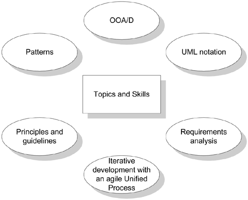

## Part 1: introduction

### Ch.1 Object Oriented Analysis and Design(OOA/D)

Objectives:
#### What's the book goals and scope?

1. Interactive development process via an agile approach to Unified Process(UP)
   * How to create an excellent OO design? classic OO design metaphor: responsibility-driven design.
  
   * How to use the language for "software blueprints", displaying thought and the form of communication?
2. Introduction to OOA/D and Applying UML.
3. Focus on fundamentals: how to assign responsibilities to objects, UML notation, common design patterns.
   - principles, heuristics or design patterns(problem solution formulas for design principles)
   - **requirements analysis** related to **use cases.**
4. Intermediate level topics: framework design and architectural analysis.

In conclusion:

- Create better object designs by applying principles and patterns
- Iteratively follow common analysis and design activities, an agile approach to UP.
- Create frequently used UML diagrams.
  

#### How to define OOA/D?

**Do the right thing**
Analysis is to investigate the problem and requirements rather than a solution.
e.g. Requirements analysis or object oriented analysis.

In OO, analysis is to find and describe the objects/concepts in the problem domain.

**Do the thing right**
Design emphasizes a conceptual solution to fulfil the requirements rather than
its implementation.

In OO, design is to define software objects and how they collaborate to fulfill
the requirements.

#### Illustrate a OOA/D example

- Define use cases from requirements (Use case UML)
- Define domain model to show noteworthy domain concepts or objects. Domain model =
  conceptual object model. (Domain Model diagram for real-world classes)
- Assign object responsibilities and collaborations, draw interaction diagrams. (sequence diagram)
- Design class diagram to have a static view of the class. (software classes diagram)

#### What's the overview UML and visual agile modeling.

UML is a **visual** language to specify and construct, document the artifacts of systems.

At deeper level in Model Driven Architecture(MDA), UML notation is the UML meta-model.

Three ways to apply UML 
- As Sketch, informal and incomplete hand drawing on whiteboards.
- As Blueprint, reverse engineering to visualize and understand the code or code generation(forward engineering).
- As programming language, to generate the executable code.

##### Three perspectives to apply UML

* Conceptual perspective
* Specification(software) perspective
* Implementation(software) perspective

## Ch.2 Iterative, Evolutionary, and Agile

### How to define an iterative and agile process

Software Development process describes the approach for the software

1. Building
2. Deploying
3. maintaining 

UP includes skill practices

Extreme Programming(XP)

* Test Driven Development(TDD)
* Refactoring
* Continuous integration(CI)

Scrum

* Common Project room(war room)
* daily scrum

Iterative lifecycle

Risk-driven development

#### Three reasons to introduce UP

1. UP is an iterative process.
2. UP provides an example structure for how to do OOA/D
3. UP is flexible and a lightweight.

#### The central idea of this book

1. How to think and design with objects
2. apply UML
3. use design pattern, agile modeling
4. evolutionary requirements analysis
5. writing use cases.

#### Modern iterative, evolutionary and agile methods

1. Scrum
2. Lean Development
3. Dynamic systems development method(DSDM)
4. Feature-Driven Development
5. Adaptive software Development.

### How to define fundamental concepts in the Unified Process(UP)?

Feedback and adaptation evolve the specification and design,
it's known as iterative and evolutionary development.

#### 3 Weeks iteration

Monday

1. 1 hour morning clarifying the tasks and goals
2. One person reverse-engineering last iteration code into UML
3. The team use whiteboards for agile modeling, sketching rough UML, write pseudo-code and design notes.

Remaining days:

1. Implementation
1. testing(unit, acceptance, usability)
1. further design
1. integration
1. daily builds.

#### How to Handle Change on an Iterative Project?

#### Benefits to iterative development

1. Less project failure, better productivity, lower defects rates.
2. Early mitigation of high risks(technical, requirements, objectives, usability, etc)
3. Early visible progress
4. Early feedback, user engagement and adaptation
5. Managed complexity
6. an iteration learning can methodically improve the development process. Iteration by iteration.

#### How long should an iteration be? 

Two to six weeks.

Central idea: small steps, rapid feedback, adaptation.

### Waterfall lifecycle

1. High rate of failure
2. Lower productivity
3. higher defect rates.

Waterfall thinking based on speculation and hearsay.

1. Write most requirements before development, 
1. Create thorough and detailed specifications or detailed OO UML models, designs before programming.
1. Write all use cases before starting to program.

#### Feedback and Adaptation

1. Early development feedbacks help programmers read specification and client demos to refine requirements.
2. Tests feedbacks help developers refine the design or models.
3. Team progress of early features' feedbacks help refine the schedule and estimates.
4. Client and marketplace feedbacks help re-prioritize the features.

### How to do Iterative and Evolutionary Analysis and Design?

