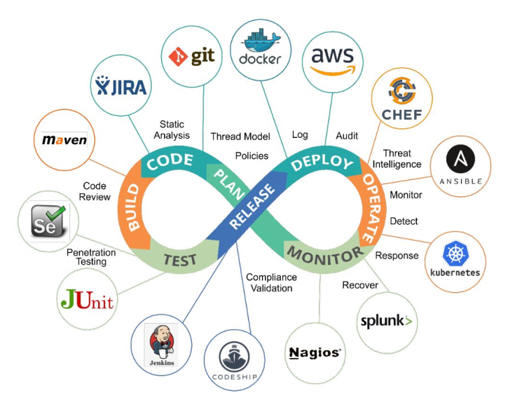

## DevOps RoadMap

[DevOps-Roadmap-Github](https://github.com/raycad/devops-roadmap)

## DevSecOps RoadMap

[DevSecOps-RoadMap-Github](https://github.com/hahwul/DevSecOps)

## Monitor tool

Sensu
prometheus alertmanager
zabbix

Development environment management

[Terraform](https://www.terraform.io/) (GO) Infrastructure management -
primarily managing remote resources in cloud providers such as AWS.

[Vagrant](https://www.vagrantup.com/intro)
(Ruby) is a tool for building and managing virtual
machine environments in a single workflow.

[Vagrant vs. Terraform | Vagrant by HashiCorp](https://www.vagrantup.com/intro/vs/terraform)
