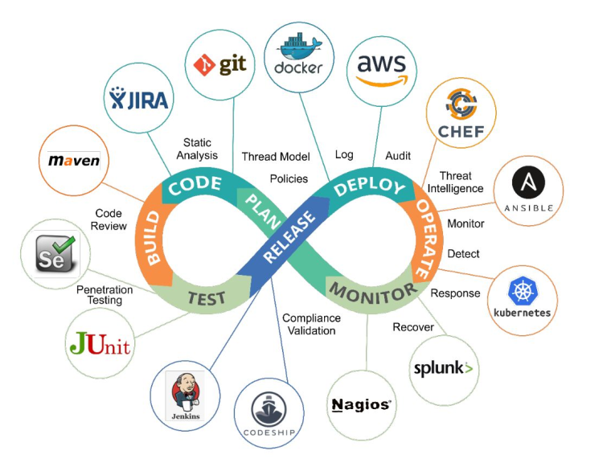

## Reference

- [SDLC](https://www.guru99.com/software-development-life-cycle-tutorial.html)
- [Agile](https://www.atlassian.com/agile)
- [DevOps Definition](https://aws.amazon.com/devops/what-is-devops/)
- [SDLC vs Agile vs DevOps](https://victorops.com/blog/agile-vs-devops)  

## DevSecOps Stages

- Threat Model
- Automated Code Review(ACR)
