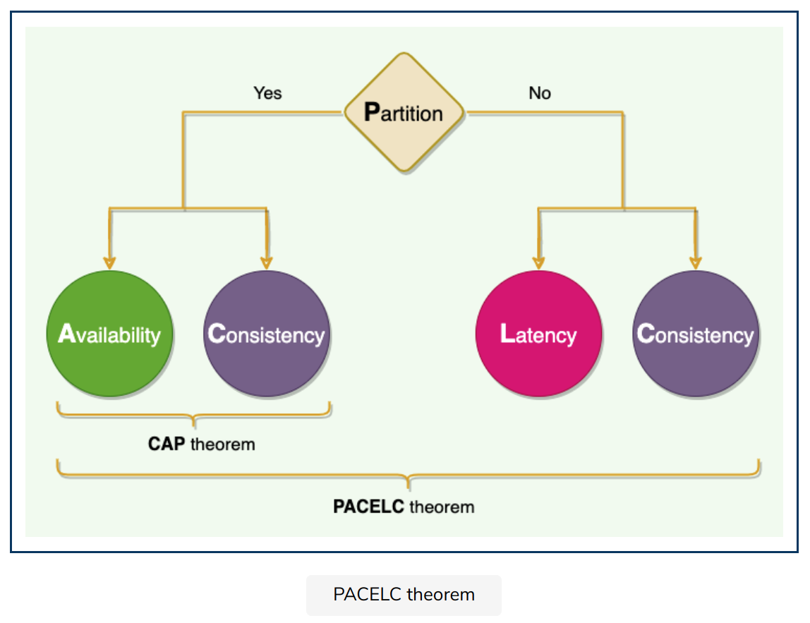
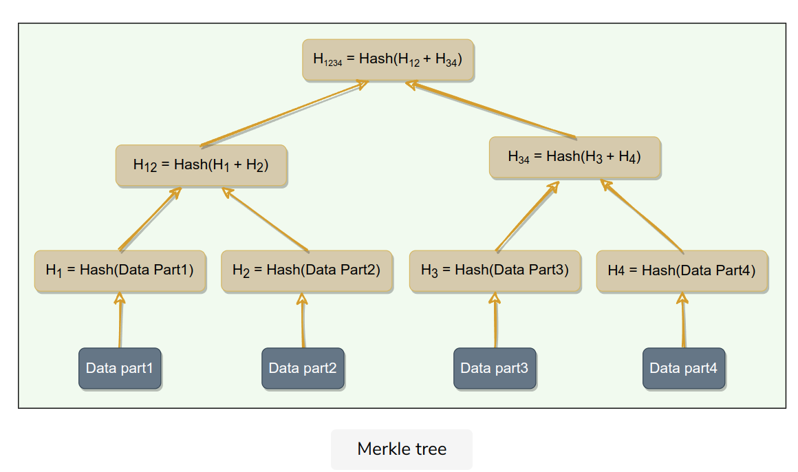

# System Design Patterns

## Bloom Filters

The Bloom filter data structure tells whether an element **may be in a set, or definitely is not**. 

e.g. **BigTable** (and Cassandra), any read operation has to read from all SSTables that make up a Tablet.

## Consistent Hashing (HA)

The act of distributing data across a set of nodes is called **data partitioning**.

Consistent Hashing maps data to physical nodes and ensures that **only a small set of keys move when servers are added or removed**.

Each notes is assigned several smaller hash ranges, where each range is considered a Vnode.

**Dynamo** and **Cassandra** use Consistent Hashing to distribute their data across nodes.

## Data Consistency

### Quorum - Consistency

In a distributed environment, a quorum is the minimum number of servers on which a distributed operation needs to be performed successfully before **declaring** the **operation’s overall success.**

Quorum is to ensure strong consistency

### Leader and Follower

Alow the leader to be responsible for data replication and to coordinate work.

e.g. **Kafka**, each partition's leader read, write into that partition and replicate it's data into backup partition.

Controller(broker) admin operations, creating, deleting topics, add partitions, check health of other brokers.

### Write-ahead Log(WAL) (append-only log) 

**or Transaction log or commit log**

Write the log into a log file before system processing.

Each log should contain enough information to redo or undo.

Each log has an identifier which helps process log segmentation/log purging.

e.g. **Cassandra** receive a write request, write the data to a commit log first. write to the commit log before write data to a MemTable.

**Kafka** implements a distributed commit log to persistently store all messages.

**Chubby**: all DB transaction are stored in a transation log.

### Segmented Log

Break down the log into equal-sized log smaller segments. (every 4 hours or every 1GB)

e.g. **Cassandra**: commit log segments are truncated when it flushed data to SSTables.

**Kafka**: use log segmentation to implement storage for it's partion.

### High-Water mark

The high water mark index is the last log index replicated to a quorum of followers. 

e.g. **Kafka** brokers keep high-water mark where consumers can only see the messages until this mark.

## Communication

### Lease

Clients get time-bound lease on resources to avoid crash, deadlock, lock indefinitely.

e.g. [**Chubby**](https://people.cs.rutgers.edu/~pxk/417/notes/chubby.html#:~:text=Chubby%20is%20a%20highly%20available,frameworks%2C%20including%20Bigtable%20and%20MapReduce.&text=The%20key%20design%20goal%20of%20Chubby%20was%20high%20availability%20and%20high%20reliability.) clients maintain a time-bound session lease with the leader.

### Heartbeat

Each server periodically sends a heartbeat message to a central monitoring server to indicate it's still alive.

e.g.

**GFS** leader communicates with ChunkServer in headbeat messages for instructions and states.

**HDFS**: NameNode keeps track of DataNodes through a heartbeat mechanism.

### Gossip Protocol

Each node keeps track of other states' state information and **gossip** its known servers' information to random node every second.

e.g. 

**Dynamo & Cassandra** uses this gossip protocol across nodes.

## Detecting failures

Dtecting node Failures, restart, network issues, etc.

### Phi Accrual Failure Detection

Use adaptive failure detection algorithm to calculate a suspicion level about a server.

It uses historical heartbeat information to make the threshold adaptive.

e.g. **Cassandra** uses it.

### Split-brain

The common scenario in which a distributed system has two or more active leaders is called **split-brain**

**Split-brain** is solved through the use of **Generation Clock**, monotonically increasing number to indicate a server's generation.

e.g. 

**Kafka** uses **"Epoch number"**. 

**HDFS** put epoch number as part of transaction ID for NameNode's generation.

**Cassandra** uses generation number to distinguish a node's state before and after a restart.

If the generation nubmer in the gossip message is higher, it knows that node was restarted.

### Fencing

Put a "fence" around the previous leader.

* Resource fencing. revoke its access to the shared storage directory or disable its network port.
* Node fencing. Power off or reset the node. "Shoot the other node in the head"(STONIT)

## Data integrity

### Checksum

Use a cryptographic hash function like MD5, SHA-512 to calculate checksum.

Commands: md5sum, sha512sum

### Vector Clocks

Use vector clocks  - (node, counter) pairs. 

First object's clock < all nodes in the second clock. Abandon the first object. Otherwise, need to have reconciliation.

e.g.

Amazon’s **Dynamo** uses Vector Clocks.

## Distributed system Theorems

### CAP Theorem

* Consistency
* Availability
* Partition tolerance.

e.g. **Dynamo**: In CAP theorem terms, Dynamo falls within the category of AP systems and is designed for **high availability** at the expense of strong consistency. 

**BigTable**: CP system. i**t has strictly consistent reads and writes**.

### PACELEC Theorem

**ACID** (Atomicity, Consistency, Isolation, Durability) databases chose **consistency**

​	e.g. RDBMSs like MySQL, Oracle, and Microsoft SQL Server (refuse response if it cannot check with peers)

**BASE** (Basically Available, Soft-state, Eventually consistent) databases chose **availability**

​	e.g. NoSQL databases like MongoDB, Cassandra, and Redis (respond with local data without ensuring it is the latest with its peers).

**Dynamo and Cassandra** are **PA/EL** systems

**BigTable and HBase** are **PC/EC** systems

**MongoDB** can be considered **PA/EC** 

## Nodes Repair(Data consistency)

### Hinted Handoff - Write repair

For down nodes, the system keep all missing write requests as notes(hints). Once they recover, the hints will be forwarded.

e.g. **Cassandra** and **Dynamo** uses Hinted Handoff.

### Read Repair

If we read data and find stale data, then call read repair operation to push newer version.

e.g. **Cassandra** and **Dynamo** use ‘Read Repair’

## Merkle Trees

How to compare a range of data on two different replicas?

e.g. Dynamo uses it.

Comparing Merkle trees is conceptually simple:

1. Compare the root hashes of both trees.
2. If they are equal, stop.
3. Recurse on the left and right children.