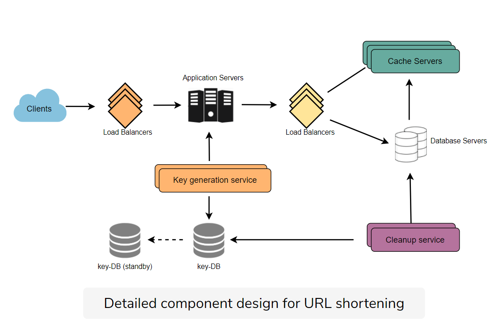

## Problem

URL shortening is used to create shorter aliases for long URLs.

## Requirements

### Functional

* Write service: given a URL, generate a short and unique alias for it.
* Read service: give a short URL, return the original url.
* Users customization: pick up a custom short link for the URL.
* URL translation has an expire time.

### Non-Functional

* High availability. 
* Real time with minial latency.
* Shortened links should not be guessable. 

### Extended requirements

* Telemetrics: how many times a rediction happened?
* REST APIs by other service.

## Capacity Estimation and constriants

**Read-heavy service**: R:W = 100:1

### Traffic

500M/Month new service

1 day = 24*3600s =86.4K 

1 month = 30 * 24 * 3600 s = 2.592 million seconds

1 year = 22.896 Million seconds

**Write**: 500M/Month = 200 URL/s

**Read**: 20K URL/S

### Storate

Store URL in 2 years:

500 Million * 12 * 2 years =  12 Billion 

Every URL takes 0.5 K

Then we have 6 Billion K = 6 TB.

### Bandwidth

Write: 200 * 0.5 K/s = 100 KB/s

Read: 100KB/S * 100 = 10 MB/S

### Memory : 80-20 rules

Cache 20% hot URLs for 24 hours.

20K/S * 86.4K seconds=1.7 B requests

1.7 Billion * 0.2 * 0.5 KB = 0.17 TB = 170 GB

### High-Level estimates

| Types of URLs       | Time estimates |
| ------------------- | -------------- |
| New URLs            | 200/s          |
| URL redirections    | 20K/s          |
| Incoming data       | 100KB/s        |
| Outgoing data       | 10 MB/s        |
| Storage for 5 years | 6 TB           |
| Memory for cache    | 170 GB         |

## System APIs

```python
createURL(
    api_dev_key, 
    original_url, 
    custom_alias=None, 
    user_name=None, 
    expire_date=None) -> string
```

```python
deleteURL(api_dev_key, url_key)
```

## DB Design

* 6 TB
* Read-heavy
* No relationship between records.

### DB Schema

#### URL DB: PK - Hash: string

original_url: string

create_time: datetime

user_id: int


#### User DB: PK - UserID: int

name: string

email: string

create_time: datetime

last_login_time: datatime


### DB Type

No relationship between objects.  No-SQL for availability and horizontal scalability.

[DynamoDB](https://en.wikipedia.org/wiki/Amazon_DynamoDB), [Cassandra](https://en.wikipedia.org/wiki/Apache_Cassandra) or [Riak](https://en.wikipedia.org/wiki/Riak) 


## Basic System Design and Algorithm

How to generate a short and unique key for a given URL?

#### Encoidng actual URL

[MD5](https://en.wikipedia.org/wiki/MD5) or [SHA256](https://en.wikipedia.org/wiki/SHA-2)

[Base64](https://en.wikipedia.org/wiki/Base64#Base64_table) with 6 letters long. 64^6 = 68.7 Billion

MD5sum to generate hash. 128 bits.

##### How to resolve hash colission?

Randomly pick up digits out of 128 bits.

Append use name id or increasing counter in md5 hashing func.

#### Generating keys offline

Key Generation Service(KGS) in key-DB.

6 chars * 68.7 Billion (unique keys) = 412 GB.

## Data Partitioning and Replication

#### Range based partitioning

#### Hash-Based Partitioning

Consistent Hashing into number between 1-256

## Cache

[Memcached](https://en.wikipedia.org/wiki/Memcached)

**How much cache memory should we have?**

170GB

**Which cache eviction policy would best fit our needs?**

Least Recently Used (LRU) can be used.

**How can each cache replica be updated?**

Whenever there is a cache miss, servers need to access DB.


## Load Balancer

1. Between Clients and Application servers
2. Between Application Servers and database servers
3. Between Application Servers and Cache servers

## Purging or DB cleanup

* Lazy cleanup
* Cleanup Service to clean periodically.
* Default expiration time



## Telemetry

* How many times a short URL has been used?
* What location is it used?
* How would we store these statistics?
* Country of the visitor, date and time of access, web page, browser, platform from where the page was accessed.

## Security and permission

Can users created private URLs or allow a particular set?

Use wide-column database like Cassandra. They key for the table will be the HASH, add one columns UserIDs.